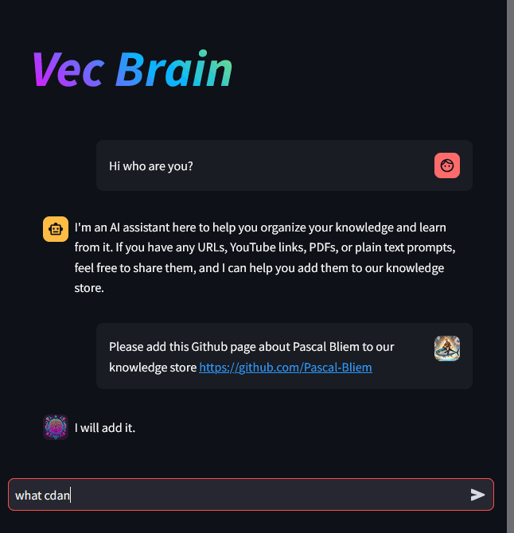
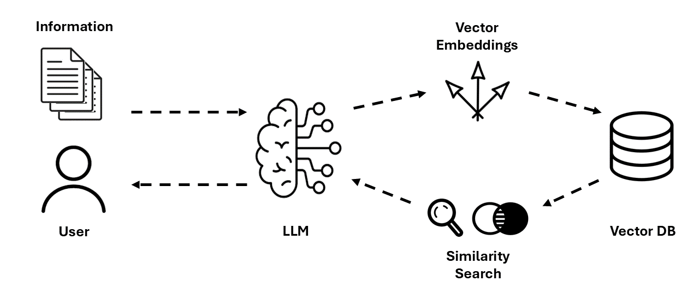

# Vec Brain LLM
A personal knowledge base app with LLM + RAG with a simple [streamlit](https://streamlit.io/) GUI.
Users can add information from different sources. The assistant will answer based on the information added. If it can't retrieve information that is similar enough to the query, it will give a general answer based on its own knowledge.
The information can be kept either persistently in [Pinecone](https://www.pinecone.io/) or ephemerally in memory.

<div align="center">
	
</div>

## How does it work?
The conversational ability of the agent is based on a large language model (LLM). The user can ask the agent to store information (e.g. from websites or documents) in the knowledge base. The agent extracts the information from the provided sources, chunks it into documents, creates vector embeddings for these documents, and saves them in a vector store.

When the user has a question, embeddings are created for that question as well and a similarity search over the vector store is performed. If similar documents are found, the agent will base its answer on the content of these documents and cite the sources. If no similar documents are found, it will give a general answer based on the underlying LLMs training data.



## Install & Run
You'll need an OpenAI api key as well as a Pinecone api key (if you want to use Pinecone as vector store).
Export these keys as environment variables, set up a Python virtual environment, and run the app like this:

```
export OPENAI_API_KEY=<your_openai_api_key>
export PINECONE_API_KEY=<your_pinecone_api_key>

python3 -m venv .venv
source .venv/bin/activate
pip install -r requirements.txt

streamlit run app/ui.py
```

In case you want to change any configuration values, you can find them in `app/config.py`.

The UI in `app/ui.py` is separated from the agents logic in `app/assistant.py`, so if you don't like streamlit, you can easily plug in another UI and just import `assistant.Assistant`.
