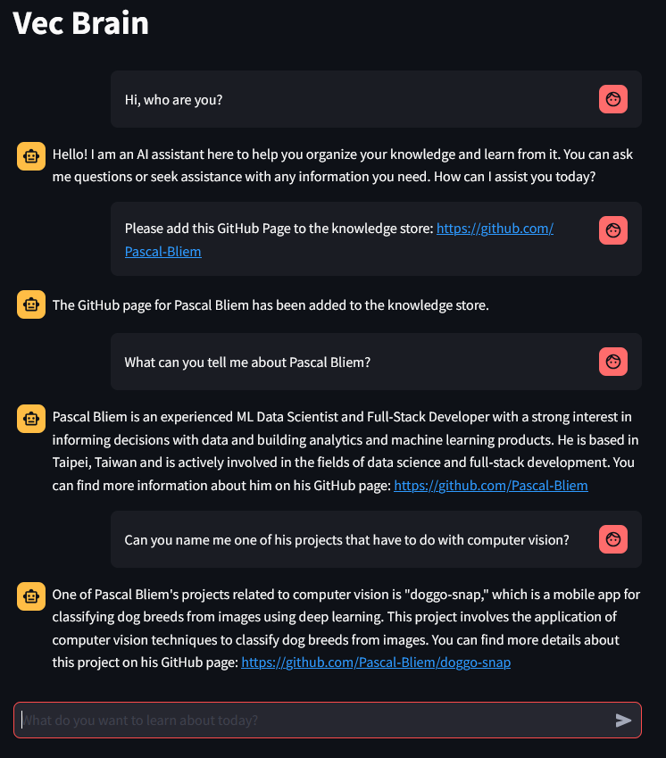

# Vec Brain LLM
A personal knowledge base app with LLM + RAG.
Users can add information from different sources. The assistant will answer based on the information added.
The information can be kept either persistently in Pinecone or ephemerally in memory.

